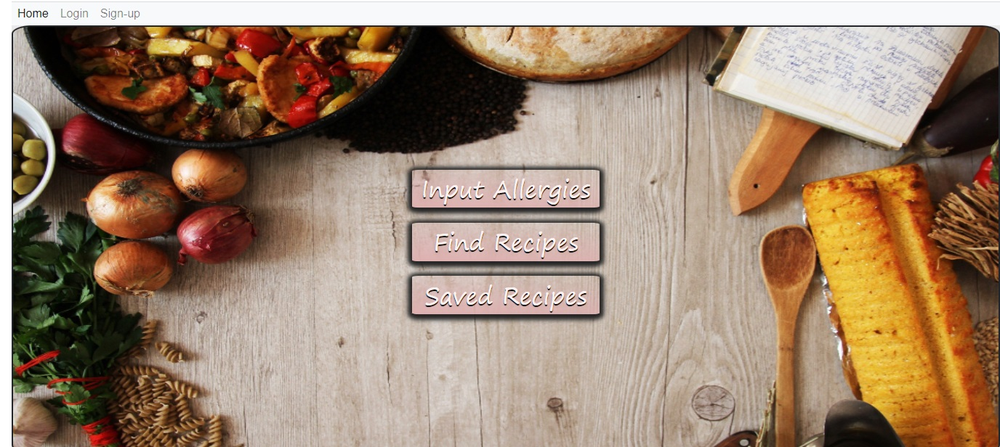
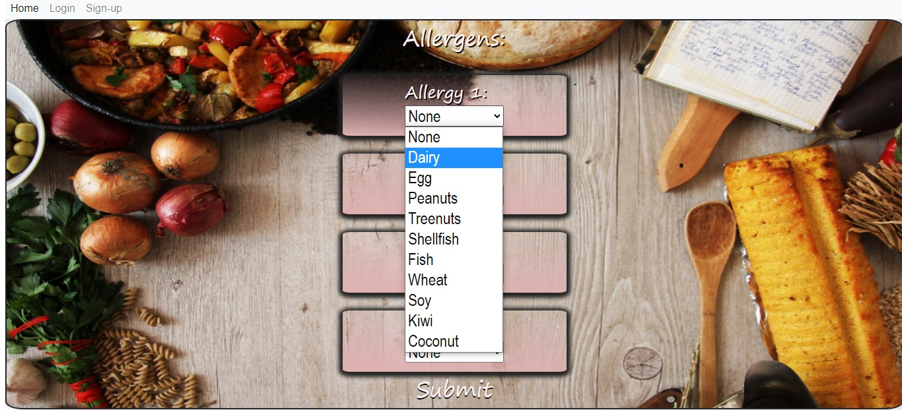

# Project 2 - Allergy Avoider

# Tables of Contents
* [Installation](#installation)
* [Description](#description)
* [Usage](#usage)
* [Questions](#questions)
* [Credits](#credits)
# Installation
Axios,                                               
Bcrypt,
Express,
Express-handlebars,
Express-session,
Mysql2, 
sequelize,

# Description
A user can input many different allergies, and the database will recommend different meal recipes that they could then prepare.
# Usage
[Click for a link to the deployed application.](https://powerful-bayou-35908.herokuapp.com/)

# Questions
If you have any questions, please e-mail me at nickjamesridgway@gmail.com.
# Credits
Github: [nickjamesridgway](https://github.com/nickjamesridgway/)
Github: [alpehcadena](https://github.com/AlephCadena)
Github: [josuereyes](https://github.com/jereyes96)
Copyright undefined. All Rights Reserved.

